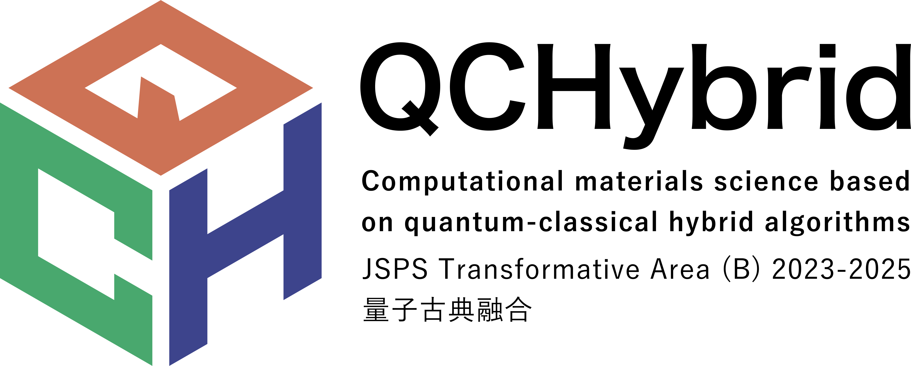

# About
This workshop aims to build a community bridging applied mathematics and computational physics, with a focus on tensor networks, quantum computing, and related computational methods for quantum many-body systems. We bring together researchers from both fields to explore the intersection of mathematical techniques and physical applications, fostering collaboration and knowledge exchange. The primary goal is to establish and strengthen connections between the applied mathematics and computational physics communities working on these cutting-edge topics.

A related hackathon will be held on March 6 - 8 (just after the workshop) in Naha, Okinawa.
See [here](https://qc-hybrid.github.io/CompPhysHack2026) for more details.

# Dates 
March 2 - 5, 2026

<!--
# Booklet
[PDF](/assets/booklet.pdf)

# Program
* [Scientific program](/assets/program.pdf)
* [Titles and abstracts of invited talks](invitedtalks.html)
* [Self-organized hands-on session](self-organized-hands-on.html): 15:10-18:00, September 27th

# Poster presentation
[Poster list](/assets/posters.pdf)
* The board size will be 164Hx113Wcm.
* Each presenter will have 1 minute to deliver their flash talk.
-->

# Program
[A tentative schedule](schedule3.html)

# Venue
那覇市職員厚生会 Naha Kouseikai ([Google Map](https://maps.app.goo.gl/MRRnJZMSgkmPLGAv7), GPS: 26.223279029350884, 127.69395848465435)

The venue is located in Naha, Okinawa, Japan, which is accessible from the airport by public transportation.

# Accommodations

Please note that participants are responsible for their own hotel accommodations. 

<!--
We will provide hotel rooms for invited speakers. Other attendees may arrange their own hotel accommodations or reserve rooms in [Kashiwa Guest House](https://www.issp.u-tokyo.ac.jp/maincontents/accommodation_en.html) directly via their reservation system. Reservations for the guest house will start 3 months before the stay date. A detailed instruction is available [here](guesthouse.html).
-->

# Registration fee
Free

# Registration
The number of participants is limited to roughly 100.
We may close the registration once the number of participants reaches the limit.

The deadline for registration is ~~January 31, 2026~~ February 19, 2026.
**Applications for contributed talks are not accepted after January 31, 2026.**

[Registration form](https://forms.gle/xRE878BgyQF4JthD9)

<!--
**Travel support**: A limited number of travel grants may be available for students and researchers with limited budgets. If you wish to apply for travel support, please indicate this in the remarks section of the registration form.
-->

# VISA Information
[Application form](https://forms.office.com/r/rRDfCcq9P8)

# Invited speakers (in alphabetical order)

* Sangkook Choi (KIAS, Korea)
* Kazu Ghalamkari (Technical University of Denmark, Denmark)
* Emanuel Gull (University of Warsaw, Poland/University of Michigan, USA)
* Ying-Jer Kao (National Taiwan University, Taiwan)
* Chusei Kiumi (Osaka University, Japan)
* Hyun-Yong Lee (Korea University Sejong Campus, Korea)
* Emi Minamitani (Osaka University, Japan)
* Seishiro Ono (ISSP, University of Tokyo, Japan)
* Nayuta Takemori (Osaka University, Japan)
* Takeru Yokota (Osaka Institute of Technology, Japan)
* Zechen Tang (Tsinghua University, China)
* Tatsuhiko Tsunoda (University of Tokyo, Japan)
* Lei Wang (Institute of Physics Chinese Academy of Sciences, China)
* Seiji Yunoki (Riken, Japan)
* Jie Wang (AMSS-CAS, China)
* ...

# Organizers (in alphabetical order)
* Ryosuke Akashi (QST)
* Wataru Mizukami (Osaka University)
* Takahiro Misawa (University of Tokyo)
* Tsuyoshi Okubo (University of Tokyo)
* Hiroshi Shinaoka (Saitama University)
* Tomohiro Sogabe (Nagoya University)
* Tatsuya Yokota (Nagoya Institute of Technology)
* Qibin Zhao (Riken)

# Support
* [FY2023-2025 MEXT -KAKENHI- Grant-in-Aid for Transformative Research Areas (B) "Computational materials science based on quantum-classical hybrid algorithms"](https://qc-hybrid.github.io) 
* FY2023-2028 JST ASPIRE "Forging a global research network for quantum information and quantum biology" 

# Contact
[compqmb2026@googlegroups.com](mailto:compqmb2026@googlegroups.com)
